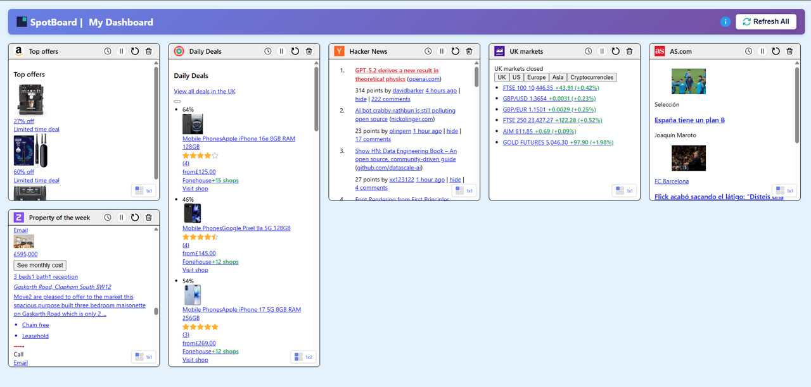

# Stop clicking through 4 sites daily. Track them all in one dashboard.

[View on GitHub](https://github.com/bondybondbond/spotboard) • [Privacy](privacy) • Chrome Web Store (coming soon)

## For who / when

**Perfect for**:
- 📈 **Finance trackers** checking Yahoo Finance movers, MarketWatch trends
- 💰 **Deal hunters** monitoring HotUKDeals popular, Groupon daily deals
- 📰 **News readers** following BBC Most Read, Guardian top stories
- ⚽ **Sports fans** tracking ESPN scores, Premier League tables

Stop clicking through the same 3-5 sites daily. Capture their live sections (trending lists, most read, scores) into one dashboard.

## How It Works

1. **Capture**: Click extension → hover over any website section → confirm
2. **Dashboard**: All sections appear in your dashboard → refresh when you want
3. **Sync**: Metadata syncs across devices (Chrome sync)

## Key Features

- ✅ Unlimited captures (max 10/board)
- ✅ Manual refresh only (no auto-refresh spam)
- ✅ Smart exclusion mode (remove ads, timestamps)
- ✅ Position-based capture (rotating content)
- ✅ Sentiment coloring (green/red for finance data)
- ✅ Zero tracking of browsing history

## What It's NOT

Pre-qualify before installing:

- ❌ Not a startpage (no bookmarks grid)
- ❌ Not RSS (captures visual layout, not feeds)
- ❌ Not auto-refresh alerts (manual only)
- ❌ Not for real-time trading (use broker apps)

## Known Limitations

Works best on list/table-style pages. May struggle with:
- Login-only content
- Infinite scroll sites (initial load only)
- Some carousels (rotating widgets)

## Privacy First

- No accounts, no backend
- HTML content stays local
- Metadata syncs via Chrome sync only
- [Read full privacy policy](privacy)

---

**Status**: Chrome Web Store submission in progress. [Follow on GitHub](https://github.com/bondybondbond/spotboard) for release updates.

**Questions?** Open an issue on GitHub or email spotboard@outlook.com
